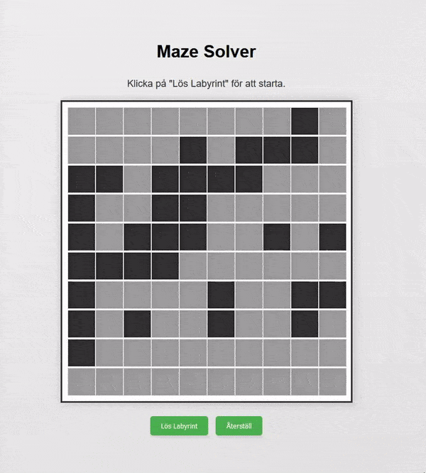

# Labyrintgenerator och -lösare

Detta projekt är en JavaScript-baserad labyrintgenerator och -lösare. Applikationen skapar en labyrint, möjliggör manuell redigering av celler och tillhandahåller funktionalitet för att lösa labyrinten med en sökalgoritm.

## Funktioner

- **Labyrintgenerering:** Genererar en 10x10 labyrint med slumpmässiga väggar.
- **Cellredigering:** Tillåter användare att redigera labyrinten genom att klicka på celler för att växla mellan väggar och öppet utrymme.
- **Vägsökning:** Implementerar en enkel sökalgoritm för att hitta en väg från start till slut av labyrinten.
- **Visualisering:** Visar labyrinten och sökprocessen visuellt.

## Demo

<p align="center">
  
</p>

## Så här använder du

1. **Ladda HTML-filen:** Öppna HTML-filen i en webbläsare.
2. **Generera labyrint:** Labyrinten genereras automatiskt när sidan laddas.
3. **Redigera labyrint:** Klicka på celler för att växla mellan vägg och öppet utrymme.
4. **Lös labyrint:** Klicka på knappen "Lös Labyrint" för att hitta en väg från start till slut.

## Filer

- `index.html`: Den huvudsakliga HTML-filen som innehåller layout och element.
- `maze.css`: CSS-filen som stilar labyrinten och kontrollerna.
- `mazeSolver.js`: JavaScript-filen som innehåller logiken för labyrintgenerering, redigering och lösning.

## Exempel

När sidan laddas genereras en 10x10 labyrint. Väggar representeras av svarta celler, öppna utrymmen av vita celler, och start- och slutpunkterna av olika färger. Användaren kan klicka på celler för att växla mellan vägg och öppet utrymme. När knappen "Lös Labyrint" klickas på, söker algoritmen efter en väg och visar den visuellt.

## Funktioner

- `generateMaze(rows, cols)`: Genererar en labyrint med angivet antal rader och kolumner.
- `setStatus(message)`: Uppdaterar statusmeddelandet på sidan.
- `setupControls(maze, start, end)`: Ställer in event-lyssnare för knapparna "Lös" och "Återställ".
- `drawMaze(maze)`: Visar labyrinten på sidan.
- `enableCellEditing(maze)`: Tillåter användare att redigera labyrinten genom att klicka på celler.
- `findPathInMaze(maze, start, end)`: Implementerar sökalgoritmen för att hitta en väg genom labyrinten.
- `isValidCell(x, y, maze)`: Kontrollerar om en cell är inom labyrintens gränser.
- `markCell([x, y], className)`: Markerar en cell med en angiven klass.
- `drawPath(path)`: Ritar den funna vägen genom labyrinten.

## Utveckling

För att köra detta projekt lokalt, öppna `index.html`-filen i din föredragna webbläsare.

```html
<!DOCTYPE html>
<html lang="sv">
<head>
    <meta charset="UTF-8">
    <title>Maze Solver</title>
    <meta name="viewport" content="width=device-width, initial-scale=1.0">
    <link rel="stylesheet" href="maze.css">
</head>
<body>
    <header>
        <h1>Maze Solver</h1>
    </header>
    <main>
        <p id="status" class="status-message">Klicka på 'Lös Labyrint' för att starta.</p>
        <div id="maze" class="maze-container"></div>
    </main>
    <footer>
        <button id="solveButton">Lös Labyrint</button>
        <button id="resetButton">Återställ</button>
    </footer>
    <script src="mazeSolver.js"></script>
</body>
</html>
```

### Notis

Se till att HTML-, CSS- och JavaScript-filerna är korrekt länkade och placerade i samma katalog för att applikationen ska fungera som förväntat.

## Licens

Detta projekt är öppen källkod och tillgängligt under MIT-licensen.
